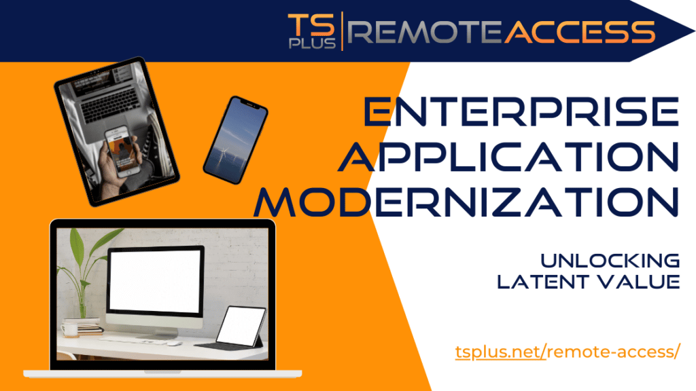

 **Over the years corporations have deployed a diverse mix of software and hardware applications to gain competitive advantage. Rapid advancements in IT, combined with evolving business needs, have resulted in contrasting IT environments across enterprises.**

At one end of the spectrum are open architecture applications that leverage on the potential of the of Internet, while the other end comprises traditional, close-ended, legacy software. It is more common than expected for corporate data to reside on legacy software. Hence, to meet tomorrows business needs, successful management and re-deployment of legacy systems is a major challenge today.

## What are Legacy Applications?

Typically, a legacy system consists of large applications that access voluminous data stored in legacy database management systems running on mainframes or mid-range platforms.

These systems made economic sense when they were developed and installed. However, as technological update frequencies multiplied and business needs evolved, they have become complex and uneconomical to maintain.

As enterprises have invested considerable amounts of time and money in these systems, how could these investments be written off?

## What are the Problems with legacy Applications?

In their current state, most legacy applications have several challenges associated with their functioning and maintenance. Here are some typical challenges.

. Legacy systems were often built for internal, enterprise-wide usage, while todays business demands that they be exposed to external entities such as the Internet.

. Such applications are inflexible and not modular. Their use consumes critical resources.

. Lack of documentation and skilled manpower make any modification complicated and can lead to crashes and breakdowns in unpredictable parts of the system.

## Benefits of Legacy Applications

Organizations continue to use legacy applications for various reasons such as:

. Legacy systems were developed for, and still run, mission-critical applications.

. A large number of users utilize the system. They are very familiar with the functionalities of the applications, including look and feel. They have also gained a complete understanding of the strengths and limitations of the system.

. The underlying hardware and software of such legacy systems is time-tested and very reliable. The applications themselves have evolved over a few decades and behave very predictably.

These factors contribute to the continued usage of legacy systems. Now, effective modernization of these legacy systems will ensure that these benefits can be amplified at minimal expense.

## Technological Progress meets IT cuts and Internet based Work-Mobility

Efforts to address the challenges of modern use of legacy applications have been piecemeal and of limited impact. The combination of new systems and retrofitted older ones have compounded the problem. Adoption of new technology and languages has often been only for technologys sake. Finally, the need to deliver application functionality via new channels like mobile devices, with differing transaction approaches add to the problems of successful legacy modernization.

More problems come with the disappearance of in-house IT teams and IT budget cuts, as well as the need for a mobile office on smaller devices or from outside company walls. With such small means and aims that have rocketed, the need for a solution has become urgent for many businesses.

## Publishing Applications to the Web to Leverage their Value

When the investments in finances, time and infrastructure are taken into account, no wonder companies are reluctant to part with stable, time-proven applications which do what they need and which their users know well.

The issue is that when evolving beyond legacy systems, business leaders must consider strategic issues such as, in no particular order:

. Tightening IT budgets

. Total Cost of Ownership

. Productivity

. Flexibility

. Knowledge availability

. Extinct vendors

. Alignment with business goals

. Administrator, IT team and User learning curves

## Web-Enabling Legacy Applications to Remotely Access them

Various options are available involving migrating from Legacy systems to more contemporary platforms (Functional Extension, Technical Extension, Migration, Replacement). There is also the solution of Application Publishing. TSplus believe web-enabling your existing applications to be the simplest and most cost-efficient and time-effective way to step into a new era, all the while keeping your corporate applications and data safe behind your company firewall.

## Remote Access as a Bridge for Legacy and Latest Applications

**An enormous advantage brought by this solution is that you get the best of both worlds. Since users access company applications and data remotely, none of that is compromised outside the firewall, which is ideal. And since any applications can be access remotely from the point when you chose to publish them and make them accessible, then you and your teams or clients can use legacy or the latest applications side-by-side without even making the difference.**

**With TSplus Remote Access, you will discover a user-friendly tool to publish your legacy applications to the web and make them accessible for use by your staff or clients in only a few clicks. For that, visit our [TSplus Remote Access](https://tsplus.net/download/) product page.**
