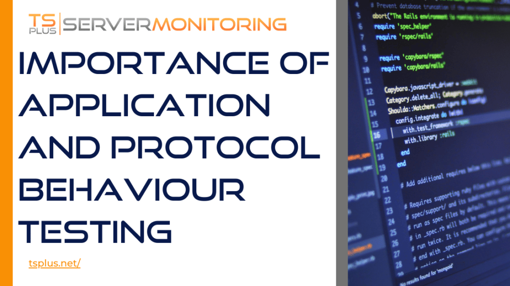

**In enterprise networks, awareness of performance problems can come from different sources. Many messages will come from a monitoring tool but sometimes they can come in the form of complaints and comments from users. These different sources will nonetheless point to different types of issues. They can also improve coherence and corporate cohesion between teams.**

## Monitoring with tools such as TSPlus Server Monitoring

Monitoring tool notifications are a great asset. With all the potential problems that can occur on a network, especially as the size goes up, monitoring is a basic that cant be passed upon. Now, such tools have a focus on "server down, switch down" alerts and not all look for the other, far more subtle, signs that can pinpoint a problem. With [TSplus Server Monitoring](https://tsplus.net/server-monitoring/), you can keep track of your websites, applications, severs and also users presence, all from one console.

## User Experience for Network Improvement

Business user complaints and comments are tangible and frequently high profile. They usually involve the Business User engagement. Such problems end up being discussed in management meetings and must be addressed quickly as well as successfully. They must be addressed even if there are no alerts from your monitoring system. After all, the automatic alerts (if they triggered at all) are not really focused on the "user experience". When a human being is having trouble performing their job, with all that entails including feeding their family, they do not want to hear statistics, however genuine their count.

## Combined Approach to Network Assessment

A standard network assessment is usually a review of network architecture. It may concern bandwidth utilisation and errors, up and down time, user presence, application use peak-times, and much more. On the other hand, there are staff, clients, other business users. Each will see & feel how the server or application itself uses the network. Their daily use can rapidly make them aware of how it actually surfs your network, be it local or Web-based. This first-hand information can be just as important to act upon as standard monitoring tool alerts.

## Tools for a Combined Application & Protocol Behaviour Feedback Approach to Monitoring

The second, person-centred information, will come via whatever communication a company chooses to put in place. The first, device-centred information, will need a good monitoring tool such as TSplus Server Monitoring. Software which can keep your IT team au-fait where two main performance and usage pools are concerned: that of all corporate servers and websites, without forgetting application usage and user presence.

Unfortunately, this perspective gets minimal attention in a standard network assessment processes. The combined assessment methodology provides a two-pronged approach which can be more interesting though more complicated to implement.

## Potential of Combining Machine and Human Feedback

This means IT agents or assessors can simultaneously evaluate and manage: network architecture, bandwidth utilization, network errors, and...

Keep track of some of the following:

- \* Watch the critical applications themselves utilize the network (from the packet level).

- \* Use tools such as Sniffer / Ethereal / WireShark as well as many other proprietary and open-source tools.

- \* Identify all delays regardless of their source (Network, Application, Servers, Database, OS, etc.).

- \* Quantify this data to the byte and the microsecond.

- \* Compare these results to the data from our Network Architecture Assessment.

- \* Review Interpaths for applications -- from Switch Port to Switch Port -- Router to Router.

- \* Evaluate Network Protocol behaviour regarding Network Transport times, TCP tuning.

- \* And more.
    
    This two-pronged approach captures the actual way applications behave on the network from multiple locations and then compares it to the network architecture. Conjointly, these two angles of work combine to provide clear understanding of the causes of the problems and provide a path for resolution.
    
    ## Advantages of Combined Network Testing
    
    There are some great advantages to this:
    
    \- It is a department-neutral approach.
    
    \- It does not assume the problem is network based, although it does analyse the network.
    
    \- It does not assume the problem is with the server or application, although the applications network behaviour is measured.
    
    All results are quantified and objective. They allow departments to come together from their own standpoints towards a same point of view, thus resolving the technical problem as well as the political one.
    
    In many cases, the problem is one of balance. Neither the network or application or any other single source is the cause of some problems. If you are only looking from the perspective of application support or network support, you may miss discovering issues that span multiple areas of responsibility.
    
    ## Bringing Support Teams and Users Together for Network Improvement
    
    This assessment methodology will uncover the truth regardless of the cause of the problems. It is then possible to fix some issues directly. Of course, some problems may require to diplomatically provide detailed documentation and guidance (if requested) to map out a path towards resolution.
    
    ## TSplus Server Monitoring for User-Friendly Network Monitoring
    
    TSplus Server Monitoring keeps track of your Servers, Websites, Applications and more from one user-friendly console. It also has a host of customisable features to simplify the surveillance of your network and to bring fluidity to the process via better and instant information. You can focus in on particular servers, websites etc. and configure email and other alerts to be sent out, all this depending on your preferences and needs.
    
    **Visit our Server Monitoring features page to find out how and test any TSplus software.**
