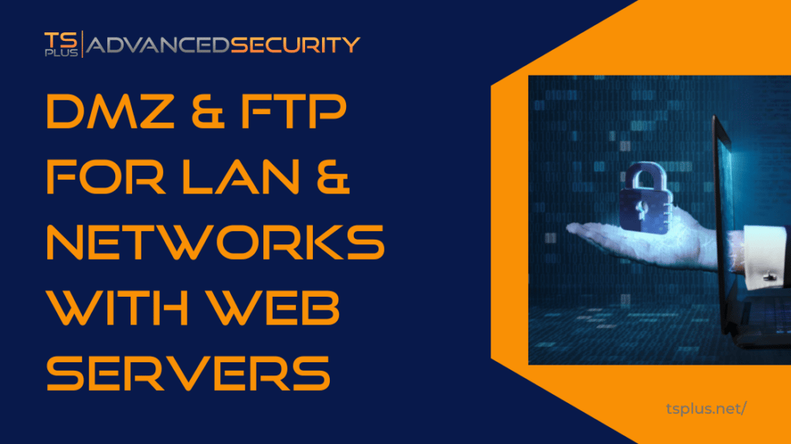

**Web Servers, FTP and Firewall Zones**

Every network that has an internet connection is at risk of being compromised. Here are some of the steps that will keep networks protected.

Whilst there are several steps that you can take to secure your LAN, the only real solution is to close your LAN to incoming traffic and restrict outgoing traffic.

Saying that, [TSplus Advanced Security](https://tsplus.net/advanced-security/) provides great all-round protection against a whole range of cyber-threats and closes some of the widest open doors.

## Separate Areas for LAN or Exposed DMZ Servers

Now, some services such as Web or FTP servers require incoming connections. If you require these services you will need to consider whether it is essential that these servers are part of the LAN, or whether they can be placed in a physically separate network known as a DMZ (or demilitarised zone if you prefer its proper name). Ideally, all servers in the DMZ will be stand-alone servers, with unique logons and passwords for each server. If you require a backup server for machines within the DMZ then you should acquire a dedicated machine and keep the backup solution separate from the LAN backup solution.

## Separate Traffic Routes for LAN and Exposed Servers

The DMZ will come directly off the firewall, which means that there are two routes in and out of the DMZ, traffic to and from the Internet, and traffic to and from the LAN. Traffic between the DMZ and your LAN would be treated totally separately to traffic between your DMZ and the Internet. Incoming traffic from the internet would be routed directly to your DMZ.

## LAN Hidden by More Exposed DMZ Servers

Therefore, if any hacker were to compromise a machine within the DMZ, then the only network they would get to access would be the DMZ. The hacker would have little or no access to the LAN. It would also be the case that any virus infection or other security compromise within the LAN would not be able to migrate to the DMZ.

## Minimal Communication for greater security of LAN Devices

In order for the DMZ to be effective, you will have to keep the traffic between the LAN and the DMZ to a minimum. In the majority of cases, the only traffic required between the LAN and the DMZ is FTP. If you do not have physical access to the servers, you will also need some sort of remote management protocol such as terminal services or VNC.

## TSplus Solutions for Increased LAN and DMZ security

[TSplus software](https://tsplus.net/) is designed to be affordable, simple and secure. Cyber-security has long been a central goal for the company, so much so that our cyber protection product has evolved to become an all-round 360 security tool-kit. TSplus Advanced Security is a simple and affordable defence developed to protect your set-up from malware and ransomware, brute-force attacks, misuse of credentials And incidentally it blocks millions of known malicious IPs. It also learns from standard user behaviours and you can whitelist addresses that are important as needed.

## Which Place for Database Servers in the Network

If your web servers require access to a database server, then you will need to consider where to place your database. The most secure place to locate a database server is to create yet another physically separate network called the secure zone, and to place the database server there.

The Secure zone is also a physically separate network connected directly to the firewall. The Secure zone is by definition the most secure place on the network. The only access to or from the secure zone would be the database connection from the DMZ (and LAN if required).

## Email - An Exception to Network Rules

The biggest dilemma faced by network engineers may actually be where to put the email server. It requires SMTP connection to the internet, yet it also requires domain access from the LAN. If you were to place this server in the DMZ, the domain traffic would compromise the integrity of the DMZ, making it simply an extension of the LAN. Hence, in our opinion, the only place you can put an email server is on the LAN and allow SMTP traffic into this server.

However, we would recommend against allowing any form of HTTP access into this server. If your users require access to their mail from outside the network, it would be far more secure to look at some form of VPN solution. This would require the firewall handling the VPN connections. Indeed, a LAN based VPN server would allow the VPN traffic onto the LAN before it is authenticated, which is never a good thing.

## In Conclusion: LAN, DMZ and Network Setup

Concerning FTP, whatever choices you make, it is important each is well planned and well thought out. Yet, it is also essential the end-result makes sense and works together as securely as possible. **Be it Advanced Security, Remote Access or any other, TSplus products have security in their DNA. You can buy or test any of them from our product pages.**

**See for yourself the features TSplus Advanced Security has to offer. To download, click [here](https://tsplus.net/download/).** **Installation takes mere moments and our software is available for free during 15-days as a trial.**
