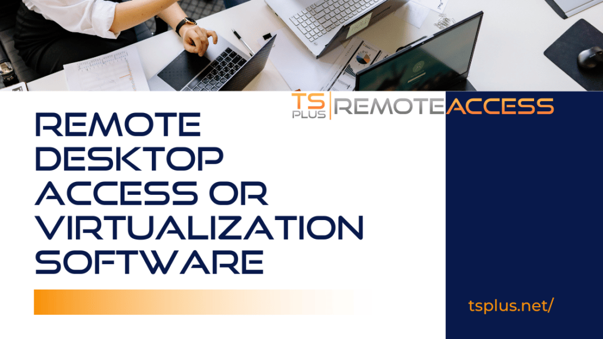

 **Virtualization software and remote desktop access software are changing the way manufacturers make computer hardware and the way companies do business, and they are also affecting how employees work their average week and how data centres are managed and run.** These changes have come out of practicality as well as necessity and seem set to affect more than just the near, predictable future.

## Virtual! Remote! Tomorrow? Today!

Remote Desktop Services have over the past decade or two, become an intrinsic part of almost every PC. It looks set to save many a company a great deal of time and money, not least because training can now be done online from just about anywhere and support provides likewise. Virtualization software has been literally forced upon the IT industry by the drastic need for greater multi-core chip architecture and a demand for greater ways to save on energy costs. Virtualization software is a technology that has also consolidated its position in the IT industry and is set to grow.

## Virtualization or Publication to Get Apps Online

Virtualization software is believed to be the brainchild of a Californian company called VMware, little less than a decade old. Seeing the potential of virtualization software, IT heavy weights have invested greatly in the company in the past. These leaders in the field of computer technology have realized the need to bend technology in a way to accommodate virtualization software and take advantage of the full scope of virtualization software.

Remote Desktop Services is driven by another IT giant. Microsoft has seen the potential of it being used from their machines. [TSplus Remote Access](https://tsplus.net/) uses the Remote Desktop Protocol inherent to Windows PCs.

It is clear that this possibility of using one piece of hardware to access the contents of another and use it has grown central to a whole portion of the population globally. Whether it is done by projecting the object onto other devices or by virtually running it elsewhere, many companies and workers could no longer do without distant access or application publishing.

## More about Virtualization Software

What is virtualization software and where it is used? It is a software technology that does away with the need for running multiple servers. With virtualization software, administrators of data centers can configure one physical server to run multiple operating systems simultaneously as if the operating systems were running on multiple machines simultaneously. This saves on the cost of investing in multiple servers without having to increase the resources of the single server. This also saves on huge costs of peripheral network devices such as network switches and hubs. Thus, virtualization software leads to massive savings on hardware costs, energy bills and maintenance costs as well, at the same time increasing utility and efficiency of the machine the virtualization software is installed on.

## More about Remote Desktop Services

Remote Desktop Services makes any PC into a server, meaning technicians can then use this server to make its applications and data available remotely from elsewhere. Once more, we can see the savings this can incur. From one server device, we can deploy any of the applications it contains so great numbers of users can run this application on the server from pretty much any remote device. No more need for countless copies of the same software and applications, to be installed and updated repetitively on endless numbers of machines. Exit software incompatibility and the negative weight of the word legacy. Gone, so many interventions and support issues thanks to the possibility of carrying them out from afar. The only real restriction is the need for an Internet connection. But, since the remote device only displays the image but doesnt run the actual application, very little data transits. Therefore, it doesnt even have to be a brilliant connection: the caf or hotel Wi-Fi will most likely be enough.

## Remote seems to be the way forwards, whichever path you choose.

At TSplus we have chosen remote desktop access to make application publication accessible to the greatest number. For this, we can thank the inventiveness of our development team, the skill of our support team and the good sense of our sales and marketing teams.

[TSplus Remote Access](https://tsplus.net/remote-access/), just like any of our products, has been designed and developed with safety, efficiency and fluidity in mind. Moreover, this user-friendly software is affordable, with permanent licenses and Support & Update available for a fraction of most competitors software on the market. Go ahead and download a fully featured [15-day trial](https://tsplus.net/) and find out more.
