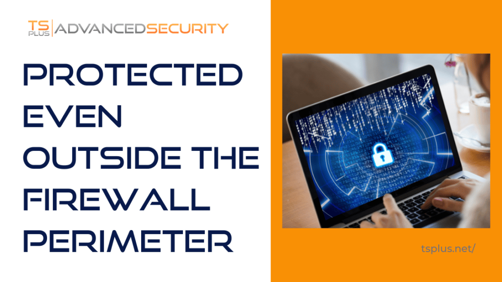

Businesses around the world are being bombarded with sophisticated threats against their data and communications networks every day.

Already, enterprises invest heavily in fortifying their IT infrastructures and enforcing comprehensive and constantly upgraded security policies against malicious code attacks. As though there was not enough to watch out for, another home-grown threat - the mobile workforce - has opened the floodgates, threatening to compromise enterprise data and contaminate corporate networks.

## Enabling Work Outside the Firewall Perimeter

In spite of mobile working offering some advantages in commercial and operational value, it is clear enterprise security policies risk stifling the effectiveness and productivity of mobile workforce devices.

Here we examine why best of breed software, in isolation, is not able to provide the mobile workforce and their laptops with the same high-level security afforded to office-based workers and why we think our [Advanced Security](https://tsplus.net/advanced-security/) solution brings together the best of both worlds.

## Two Lines of Defence in a Protected Corporate Environment:

Currently organisations anticipate, detect, and prevent threats from laptop and other mobile device attacks via a layered approach.

This is coupled with centralized, uncompromising IT policy which overrides an individuals control over their own laptop.

As IT departments prioritise corporate IT governance, their primary method of effectively enforcing organizational security policies is by controlling all networking components.

## First Line of Defence: Corporate Hardware and Software

When connecting to the Internet from within the corporate network, laptop users are protected by two lines of defence.

A comprehensive set of IT security appliances running secured and hardened Operating Systems, and security software including firewalls, intrusion prevention/detection system, antivirus, anti-spyware, anti-spam, and content filtering, all of which are completely controlled by the respective corporate IT team.

## Second Line of Defence: Individual Device Software

This is coupled with personal firewall and antivirus software installed on the users laptop and controlled by the user.

Additionally, when laptops are within the protective corporate environment, the organizations IT department can exercise full and consistent control over (and visibility of) any device, which is a critical operational consideration. This means the IT team can:

- consistently update respective laptops with data, policies, etc., and
- monitor the entire network effectively vis--vis the status of all network components.

## Outside the safe zone: Need for Protection Beyond the Firewall

Once a laptop starts 'roaming' outside the enterprise governed network, the 2-line defence system no longer applies. Indeed, in practice, the laptop, is no longer protected by the corporate security appliances layer. This leaves it exclusively dependent on the security software installed on the local operating system.

The roaming laptop is exposed to potential threats from nearby wireless and wireline devices (in hotels, business lounges, airports, Wi-Fi at Internet cafs, etc.).

## Bringing Danger Back Into the Firewall Perimeter

These threats signify a danger far beyond the scope of the individual laptop. Now, once the laptop had returned to its base and is connected to the enterprise network, intrusive code may proceed to use the laptop as a platform for breaching corporate security. What used to be a perfectly solid protection needs reviewing, urgently.

## Result of Lack of Protection Oustide the Firewall Perimeter

Relying solely on the best of breed software on the laptop is insufficient due to:

- Operating System inherent vulnerabilities. By definition, security software running on Windows is subject to inherent Windows vulnerabilities, effectively exposing personal firewall and antivirus applications to malicious content attacks.
- Unknown threats. The security software can only defend against known threats. By the time these threats are added to the knowledge base, it may be too late.
- Immediate damage. Malicious content executes directly on the platform to be protected, rather than on a security appliance designed to filter the content and serve as a buffer.
- Managing security level. Making sure all the computers have the latest security updates installed as well as enforcing a unified security policy are two rather difficult tasks to keep in hand. When the computers themselves are at the front line, these security weaknesses can be disastrous to the entire network. In other words, its all or nothing, either the entire network is secure or nothing is secured.

## Where to Look for 360 Anywhere Protection

Consequently, many organizations are driven to adopt tough security policies prohibiting most wireless networking options. The downside of this: significantly limited user productivity and remote computing freedom. Otherwise, they impose strict, costly and difficult to enforce cleansing procedures for laptops that return from the field.

**Having seen this need and worked on a solution involving keeping this newfound freedom, TSplus can proudly present Advanced Security.**

## Best Line of Defence, In and Out of the Firewall Perimeter

TSplus has a different option at hand in the shape of [Advanced Security](https://tsplus.net/advanced-security/). Each product developed by our in-house team is well thought out to provide simple efficient software that does what businesses need without the hassle. We have chosen to make our 2 Factor Authentication set-up available as an add-on so it can be purchased freely and not only as part of a bundle.

**We have also worked on an all-round protection product, Advanced Security, to ensure our users can go about their daily work with their mind at peace that their IT set-up is safe as houses. For features, downloads, set-up and prices, check out our [website](https://tsplus.net/). You can even test any of our software for 15 days for free before buying.**
