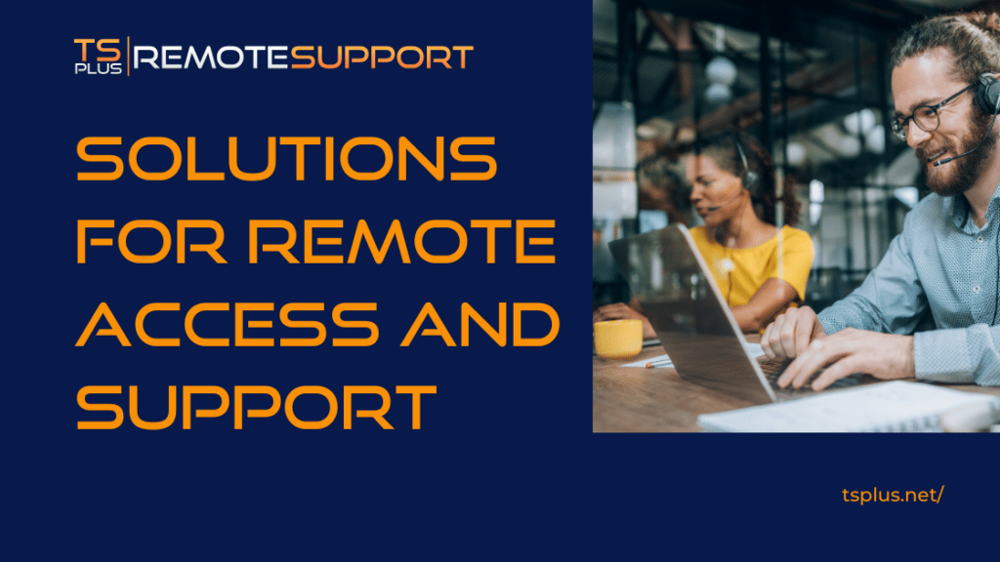

## Growing Need to Remotely Access and Support Devices?

Many IT departments are operating in down-sized as well as under-staffed environments. Employees are therefore being forced to manage an exceptional amount of mission-critical server room equipment, much more than what they can handle. As a consequence, their ability to remotely monitor and repair computer problems on the go is essential, whether in a corporate context or a providers modern data centre.

## Solutions for Remote Access and Support

The following two remote monitoring options available for controlling computers over IP will allow network administrators to view computers and access problems as they arise. Read on for some similitudes and differences between two of the most popular methods of remote access computer management in the industry today.

## Hardware or Software Solutions for Remote Access and Support

Both hardware and software based remote computer management solutions offer users valuable remote IP access when needed. However, each solution holds their own when comparisons are drawn between these unique solutions. Hardware-based hypervisor devices and software-based remote desktop clients perform so that it seems you are sitting directly in front of the target system. This makes it manageable from anywhere in the world with an internet connection. That main feature set aside, let us see how they work and what they do.

## Virtualisation and RDP Solutions for Remote Access Management and Support

A closer look behind the hardware component of Windows equivalents to KVM over IP and the software driven Remote Desktop makes them appear as two very similar remote access methods. In order to truly understand the key features as well as their limitations here is a quick break-down of each individual solution. This will lead us into introducing our [TSplus Remote Support](https://tsplus.net/remote-support/) remote control software solution.

## Hypervisor Remote Access Management and Support Solution

Hypervisors are a hardware-based solution which allows users to gain both in-band and out-of-band access to all the servers either connected to hypervisor switch or directly connected to a single computer.

Late night trips to the data centre to reboot one server have become a thing of the past because of this simple yet robust hardware component. The virtual front-end will connect directly to a computer or hypervisor switch and permits remote users to gain secure BIOS-level access to manage mission-critical servers. Remote IP management is generally conducted through a standard internet browser session. Front-end IP products work their magic by allowing remote users to gain full keyboard, video monitor, mouse access of any attached computers from any location with internet connectivity.

Some client software is automatically downloaded from the hardware device, eliminating the need to install client software on each user desktop. Furthermore, particular client software supports most major Web browsers. Different numbers of users can remotely access the same server for a team troubleshooting approach.

## Remote Desktop Software as a Remote Access Management and Support Solution

Remote access software programs take advantage of easily loading software on the local computer or, in some cases, both local and remote computers. They also allow users to view and take remote control of keyboard, mouse and video monitors to view and access servers in the data centre from any location with internet capabilities.

There are several types of remote management software and many developers and resellers. Some can only be used on Windows-based computer systems, while, on the other hand, others can be used across operating system and environments.

Although most remote access software is simple to load and though individual use may even be free, the fact that certain products require the remote management software to be installed on every machine needing remote connectivity in the data centre. Also, one thing to bear in mind regarding remote access software is the fact that it will also often require having the remote operating systems up and running at the application level for the remote session to work properly.

If the operating system crashes on the remote computer at any time during remote connectivity users will be forced to find alternative ways to activate the remote computer. This will result in needing to physically reboot the remote server from a cold start in most cases.

Using a platform independent software approach requires users to load software on both client and server computers. In addition, the local and remote computers do not need to be running the same operating system.

## Conclusions on Virtualisation or RDP for Remote Access and Support

Clearly there are advantages and disadvantages on either side. Each has particular potential and specific requirements. That said, one aspect that is interesting nowadays is the lightness of remote access compared to virtualisation. Indeed, the hypervisor tools are likely to be more greedy of bandwidth and live memory for the local device and its connection, whereas particular remote software such as [TSplus](https://tsplus.net/) need little of either, since the processing happens within the server while the remote device has the charge of displaying everything on the users screen.

## TSplus Solutions for Remote Access and Support

**TSplus Remote Support, Remote Access and Remote Work are all useful in various aspects of what remote access management can comprise. Here, Remote Support is the key product since its main purpose is the control of remote devices.**

**Use our software to remotely support colleagues or clients, remotely fix issues and update software seamlessly, silently and efficiently, collaborate for training or problem solving. You can [test our fully featured latest version](https://tsplus.net/remote-support/) of Remote Support for 15 days for free.**
