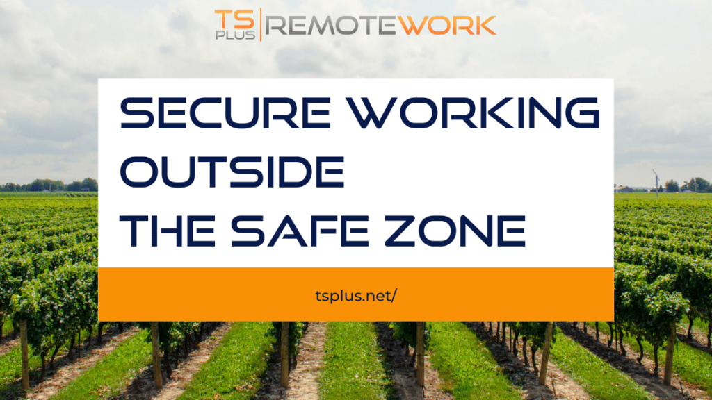

A growing number of company IT security services have decided to place computers behind a robust security gateway, usually a dedicated security appliance or a cloud service, to counteract the current weaknesses in laptop security. Indeed, as soon as staff work away, accessing corporate files and information remotely, security becomes a complicated matter. Or at least it did, since solutions are at hand to protect these remote workers and their companies, wherever they may choose to work. **[TSplus Remote Access](https://tsplus.net/remote-access/) and its companion software form such a solution. Find out all it takes to setup for secure remote work outside the safe zone.**

## Hardware Security Gateway to Secure Remote Infrastructures

First, is the hardware solution. These set-ups are equipped with hardened operating systems that do not have security holes, back-doors, or unsecured layers. They are designed with a single purpose, to provide security.

When these security appliances are hardware-based and not software-based, they provide the following advantages:

- They cannot be uninstalled. Security attacks often start by targeting the security software, mainly by trying to uninstall it or to stop its activity. On the other hand, a software-based security solution, as any software program, includes an uninstall option that can be targeted.

So in contrast to a software solution, appliance-based security cannot be uninstalled as it is hard-coded into the hardware.

- They have non-writable memory. Hardware-based solutions manage the memory in a restricted and controlled manner. Security appliances can prohibit access to their memory, providing greater protection against attacks on the security mechanism.

## Added Bonuses of a Hardware Plus Software Setup for Secure Remote Work Outside the Safe Zone

The use of hardware allows the combination of a comprehensive set of security solutions in a single device. Indeed, it is always possible to add software solutions which will come to complement the hardware defence.

In addition, the certain tension between users and IT managers over their computing freedom can be overcome via hardware.

## Settling Differences - Setup for Secure Remote Work Outside the Safe Zone

On one hand, users want to have complete freedom when using their computers, while on the other hand, IT managers try to enforce security policies (e.g. banning the use of social networks and forums or of P2P software).

By setting up a secure infrastructure, IT managers can solve this conflict to a great extent.

## Cloud and Dematerialised Hosting for Cybersecurity Outside the Safe Zone

Nevertheless, as Internet progresses and much of what we do moves into the cloud, this is evolving. It used to be that with software, policy was part of the laptop or computer. With modern remote access possibilities and cloud hosting, security policy can be enforced directly on the Web. Consequently, just as with a hardware set-up, the user has complete freedom inside a safe corporate computing environment. The difference is that the whole of this is over HTTPS, via set user credentials, and it is vetted by software that remains safely behind company or provider Web-security walls.

## TSplus Remote Access for a Safer Distant Working Experience

Via the [TSplus Gateway Portal](https://tsplus.net/remote-access/features/), users remotely access their office desktop session just as they may at the office, using their single sign-on credentials. 2FA and Advanced Security two perfect add-ons for the situation we have been discussing. No matter from where or from what device your users log in, company data and files remain safe, benefit from our all-round protection.

## Conclusion on a Setting Up For Secure Remote Work Outside the Safe Zone

Depending on company requirements, you can have one or the other solution, or the best of both. No wonder IT and security staff are moving away from old habits to provide corporate level security for laptops and any other device operating outside the safe roaming office environment.

The only thing left is to decide between a dedicated appliance or a cloud solution, which can still be self-hosted or on subscription. Both set-ups can hold all of the best of breed security software and are therefore able to re-introduce the two lines of defence enjoyed by office-based PCs.

By introducing a security gateway, should security be breached, the damage stops at the gateway.

**Try TSplus for free for 15 days or find out more, [here](https://tsplus.net/).**
