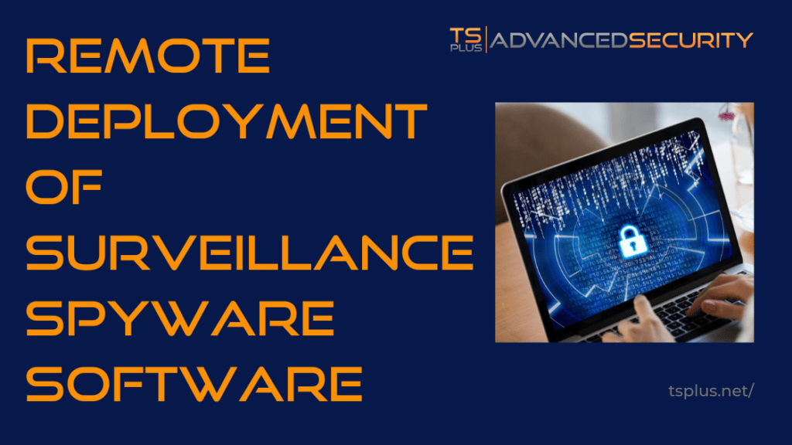

 **Contrary to popular belief computer users are at a great risk of being invaded by spyware and other surveillance software via remote areas. Normally, people were unconcerned with surveillance software because it was assumed it could only be installed with physical access.**

## Surveillance and Spyware Software - Remote Versions Advertised

Several surveillance software and spyware providers are now advertising remote deployment software. These can be installed from any computer anywhere and the information collected from the subject is sent back to the intruders computer.

## Insidious Not Destructive Surveillance Spyware Software

Bear in mind that spyware or surveillance software can easily be slipped into someones computer through an email attachment, greeting card or simply by visiting a web site. Instead of destroying a computers hardware as do Trojans and viruses, surveillance software works silently. Indeed, it will trawl through the computer to gather personal information to send to a third party. Many users have thought in the past that such software could not be installed without physical access but remote deployment spyware is on the rise.

## Various inroads for Surveillance or Spyware Software

Remote deployment of surveillance software through email often works by sending an attachment that often looks like a screen saver. But once it is opened, the users device is immediately infected. Surveillance software is remotely deployed through web sites by the browser displaying a message. Now, if the user accepts, usually unbeknownst to themselves, a malicious file is activated which contains spyware.

Snoops also send surveillance software through greeting cards, PDF attachments and the like. The intruder sends an electronic document. They may impersonate a colleague, supplier, provider, competitor, client. When the user views the e-card or other they are inadvertently infected with spyware.

## Damage and Dangers of Surveillance and Spyware Software

These methods of remotely installing spyware onto someones computer work well because users are unaware that the installation is possible silently, without physical access. Firewalls, anti-virus and adware scanners are incapable of detecting and removing these surveillance applications. To rid your computer of the spyware you must download a tool designed specifically for detecting and removing surveillance software.

## Guarding Against Surveillance and Spyware Software with TSplus Advanced Security

Securing your corporate servers and remote work infrastructure is a delicate matter to leave unsolved. We believe **Advanced Security** is the most powerful set of security features ever combined, offering 360 protection to your remote IT setup. It features both guards against external attacks and management of when logins and published applications are used, but also much more.

**Come and find out more on our product pages, whether you want a [15-day free trial](https://tsplus.net/advanced-security/) or further information and installation requirements.**
