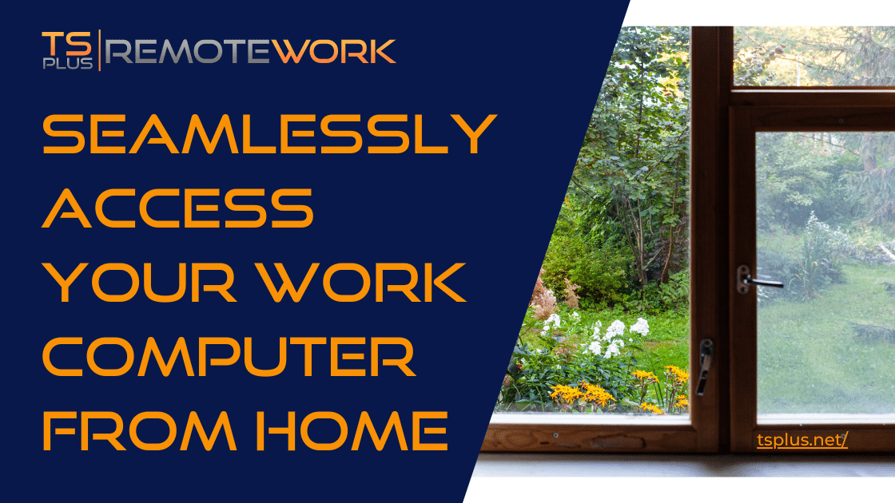

As a company, are you looking for the ideal Web Access solution? One that is reliable, secure, and easy to use? With TSplus, for well over a decade, you have been able to access your remote desktops with ease using Remote Desktop Services (RDS). Enjoy work from any device, whatever you're using. Indeed, connect from Windows, Apple, Linux, Android, thanks to our TSplus Web portal. So, read on to [seamlessly access your work computer from home with TSplus remote software](https://tsplus.net/).

## Possibly the Simplest Web Access Solution for Instant Deployment

TSplus offers a range of features that make it the best choice for businesses of all sizes. With HTML5 to smooth the way, our software is quick to implement and simple to use. The connection broker on the home device screen is clickable, like any other application. Next, users log in via the welcome page which will open on their favourite browser. Their desktop then opens in the browser as though they were on their office workstation.

The features of our home-working software draw on our experience in remote access and control technology. TSplus Remote Access but also Remote Support can both answer the need for a way to immediately and easily deploy an office workforce to distant devices.

Indeed, many companies may not automatically want to publish apps or use farm related remote access possibilities. For these wider ranges of possibilities, you can harness the full power of Remote Access and Remote Support. Hence this simple straightforward use of our software to provide the solution for businesses with that sole specific need.

## Use the Web to Seamlessly Access Your Work Computer From Home

Here are just a few of the features that you can enjoy with TSplus Remote Access:

1. Easy Web access - TSplus provides users with a web portal that allows them to access their RDS environment from any device with an internet connection. This web portal is easy to use and requires no additional software or plugins.
    
2. Secure Access Security is a top priority for TSplus. With our software, all connections are fully encrypted using SSL/TLS protocols to ensure that your data is protected.
    
3. Multi-Platform Support - TSplus supports a wide range of platforms thanks to this use of a Web portal. Therefore, you can access your RDS environment from any device, whether you're using a desktop, laptop, tablet, or smartphone.
    
4. Remote printing  Amongst other things, TSplus Remote Access allows users to print documents from their remote session to a local printer, making it easy to work from anywhere while still having access to the tools you need.
    
5. Remote desktop management - With TSplus Remote Access, administrators can easily manage their remote desktop environment from a central location. This includes managing users, applications, and desktops.
    

As you may realise, our software contends as a fair solution compared with some of the biggest kids on the block. See how the screen control and support capabilities we provide make us proud to stand as the affordable [Citrix alternative](https://tsplus.net/alternatives-to-citrix/).

## To Conclude: Easily and Seamlessly Access Work Computers From Home

**In summary, [TSplus Remote Access](https://tsplus.net/remote-access/) is ideal as a solution to remotely access any Windows workstation. With its easy web access, secure connections, multi-platform support, remote printing, and remote desktop management features, TSplus offers businesses the flexibility and security they need to stay productive from anywhere.**
