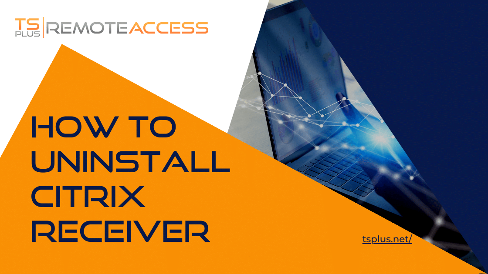

 Citrix Receiver is a software application that enables users to remotely access virtual desktops and applications from a variety of devices. However, there may come a time when you need to know how to uninstall Citrix Receiver from your computer. In this article, we'll walk you through the steps to successfully remove Citrix Receiver from your device. Then you can find out a few details about our very own alternative, and how [TSplus Remote Access](https://tsplus.net/remote-access/features/) can save you money and time.

## How to Uninstall Citrix Receiver: A Step-by-Step Guide

The process for uninstalling Citrix Receiver will vary slightly depending on your operating system. However, the general steps are as follows:

1. #### Close all Citrix Receiver Windows
    
    Before you attempt to uninstall Citrix Receiver from your computer, make sure that all open Citrix Receiver windows are closed. This will ensure that the uninstallation process goes smoothly.
    
2. #### Remove Citrix Receiver Using the Control Panel
    
    Next, navigate to the Control Panel on your computer and select "Add or Remove Programs" or "Programs and Features." Find Citrix Receiver in the list of installed programs and select "Uninstall." Follow the on-screen prompts to complete the uninstallation process.
    
3. #### Remove Remaining Files
    
    Once the uninstallation process is complete, you may still have some remaining Citrix Receiver files on your computer. To remove these files, open File Explorer and navigate to the following folder: C:Program FilesCitrix. Select the "Citrix Receiver" folder and delete it.
    

## TSplus Alternative to Citrix Receiver

If you're looking for an alternative to Citrix Receiver, consider TSplus. TSplus Remote Access is a remote desktop software that enables users to securely access a desktop from any device. It is also a powerful means of application publication and remote desktops and access management. With TSplus, you and your teams or clients can access desktops, applications and more from anywhere in the world, using any device that has an internet connection.

## Easy to Install Alternative to Citrix Receiver

TSplus Remote Access is easy to install and configure. Thus, it allows you to quickly get started with remote desktop access. In just a few minutes, you can have our software up and running on your device. In a few clicks, you can make your desktop accessible from another PC, a smartphone or a tablet. You can also publish any app, be it hot off the press or legacy, and seamlessly open it from your chosen remote device.

## TSplus Remote Access Advanced Features

Remote Access also offers advanced features, such as customising the web portal, active directory supported and [web lockout](https://docs.terminalserviceplus.com/tsplus/web-lockout). Amongst the wide range of features some will enable you to be more productive and efficient while using remote desktop access. There are also many to increase the security of the remote access process. Anyhow, each work together to provide a simple yet versatile remote software publishing and desktop access experience.

## Conclusion

In conclusion, if you need to uninstall Citrix Receiver from your computer, follow the steps outlined in this article to ensure a smooth process. And when looking for an alternative to Citrix Receiver, give [TSplus Remote Access](https://tsplus.net/remote-access/) a try. With its ease of use, great value-for-money and advanced features, TSplus is a great option for remote desktop access and application publishing.
