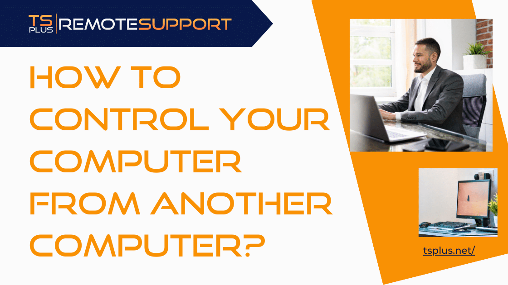
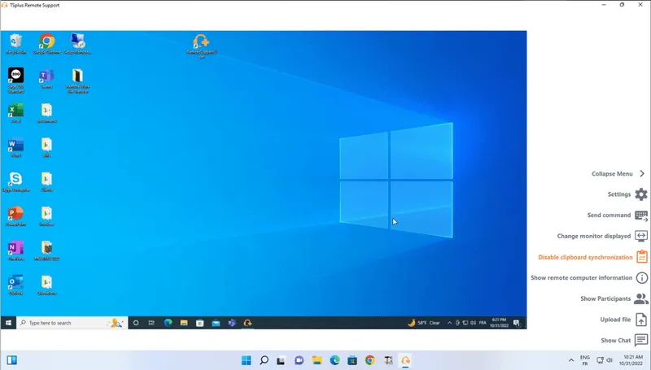

## Remote Computer Control: Available Alternative Methods?

More than ever, the ability to control your computer from another computer is a valuable skill. Whether you need to provide technical support, collaborate on projects or access your files remotely, it has many uses. In fact, the convenience and flexibility of remote computer control can greatly enhance productivity and ease schedules. Remote Control also means you dont need to take your computer wherever you go, yet still having a hand on it.

In this article, we will see some of the main methods and tools for screen sharing and remotely controlling other devices. Business owners or IT agents, this part is for you since you could greatly benefit from doing so seamlessly with our professional tool. Come and find out how to control your computer from another computer. And, why not, [try TSplus Remote Support](https://tsplus.net/remote-support/).

## Many Ways to Remotely Control Your Computer From Another Computer

Mastering remote computer control opens up a world of possibilities for productivity and convenience. No matter whether you choose to use built-in features like Windows Remote Desktop, install third-party applications, or leverage web-based services. Indeed, the ability to control computers from another computer promotes efficiency and effective collaboration and lets access your resources from anywhere.

## Whistle-Stop Tour of The Methods for Controlling Another Computer Remotely

Here are 8 ways from which you can choose:

1. ## Windows Remote Desktop:
    
    One popular method for remote computer control is Windows Remote Desktop. This built-in Windows feature allows you to connect to and control a remote computer as if you were sitting in front of it. To use Windows Remote Desktop, you need to enable it on the target computer and have the necessary permissions. Once configured, you can establish a secure connection and control your computer remotely.
    
2. ## Chrome Remote Desktop:
    
    While looking at native software, free can also be interesting. Chrome Remote Desktop brings similar features for free. Of course, it works hand in hand with the Chrome web browser. Depending on what browser you generally use or if you need a professional level application for remote control, read on.
    
3. ## Third-Party Remote Access Tools:
    
    In addition to Windows Remote Desktop, numerous third-party applications provide remote access capabilities. These tools often offer additional features and cross-platform compatibility, enabling you to control your computer from various operating systems. These tools typically require installation on both the local and remote computers and offer secure encrypted connections.
    
4. ## Web-Based Remote Control:
    
    Web-based remote control allows you to access and control your computer using just a web browser. These services enable you to establish a connection without the need for installing additional software. By simply logging into the respective service, you can gain remote access to your computer, provided it is turned on and connected to the internet.
    
5. ## Virtual Private Network (VPN):
    
    A Virtual Private Network (VPN) creates a secure connection between two or more computers over the internet. By connecting to a VPN server, you can access your computer remotely as if it were on the same local network. VPNs provide an added layer of security by encrypting the data transmitted between the local and remote computers. Please, bear in mind that VPN security remains as strong as the security of the passwords opening the tunnel.
    
6. ## Command Line Tools:
    
    For advanced users comfortable with the command line, several command-line tools are available for remote computer control. Tools like SSH (Secure Shell) and PowerShell Remoting allow you to execute commands, transfer files, and control your computer remotely. These tools are particularly useful for system administrators and developers who prefer a command-line interface.
    
7. ## Mobile Device Remote Control:
    
    In addition to controlling your computer from another computer, you can also use mobile devices such as smartphones or tablets for remote access. The ability to connect to and control your computer remotely using your mobile device allows you to access your computer on the go.
    
8. ## TSplus Remote Support:
    
    Last but not least! AS a remote control tool, TSplus Remote Support fits in more than one of the above categories. Mainly, it provides a quick and easy way to remotely share and control screens. For agents, the console and features comprise all the essentials. Meanwhile, for hosts a full console or a Lite Mode are available.
    
    And what's more, you can send command lines within your Remote Support sessions. Either send select preset ones in the general mode, or directly connect in a command line remote session.
    

Now, you may want to experiment with different possibilities. Testing is a sure way you can find which method best suits your needs.

## Unlocking Seamless Remote Computer Control with TSplus Remote Support

When it comes to controlling your computer from another computer, TSplus Remote Support offers a comprehensive and user-friendly solution. Designed for businesses and individuals alike, TSplus Remote Support empowers users with seamless remote access capabilities. Let us explore the [installation process of TSplus Remote Support](https://tsplus.net/remote-support/installation/#basics).

## TSplus Remote Support Installation

Installing TSplus Remote Support is a straightforward process. By following the clear and concise installation instructions provided in our Quick-Start guides, you can quickly set up our software on your computer. The Remote Support package is lightweight, minimizing resource usage and ensuring optimal performance.

Once installed, TSplus Remote Support integrates seamlessly with your existing IT infrastructure. It requires no complex configuration or additional hardware, making it an ideal choice for both small businesses and large enterprises. Lastly, the intuitive management console allows you to easily configure and customize your remote access settings, granting you full control over the connection.

## How to Control Your Computer From Another Computer:

Prior to controlling any computer, remember you need an active TSplus licence to control a device. Nonetheless, you can share your screen without having an account. Your 15-day trial account enables you to control or share for 15 days. This is [a great way to test TSplus Remote Support features.](https://tsplus.net/download/)

1\. Download and install RS on both your computer and the other computer.

2\. In the Remote Computer Access box of the newly opened window of the other computer, enter the Remote ID of your own computer and click connect.

3\. In the window that opens next, you can enter the corresponding password showing on the host computer. You can then click this connect button to open the Remote Support session.

4\. Once you have clicked connect, your host screen will appear on the distant computer controlling it. Here is an example of what it will look like with our simple TSplus Remote Support console framing the end-user's screen.

Read on for more detail of what features are at your fingertips now.

## TSplus Remote Support Features to Control Your Computer From Any Computer

Here are some main features and features and highlighting how TSplus Remote Support enables efficient and secure computer control from any location. Our remote control software boasts an array of powerful features that simplify remote computer control.

To start with, TSplus Remote Support prioritizes security. For this reason and for the sake of speed, we have self-hosted dedicated servers placed strategically on all 5 continents. By leveraging **HTTPS encryption and TLS 1.2** technology, we ensure that your remote sessions are protected from unauthorized access and data breaches. All this guarantees your sensitive information remains confidential during remote control sessions. Here is to peace of mind while accessing your computer remotely.

Another notable feature of TSplus Remote Support is its rapid and robust file transfer capabilities. With a simple **drag-and-drop** interface, you can easily transfer files between the local and remote computers. Whether you need to retrieve important documents, share files with colleagues, or backup critical data, TSplus Remote Support simplifies the file transfer process, enhancing productivity and collaboration.

Add to this **command line** and **session recording**, **multiple screens** and **multiple agents**, and you have the premises of a tool IT administrators and roaming users anywhere cannot do without. That's without having looked at all the features and possibilities at hand.

## In Conclusion: Controlling Your Computer from Another Computer is Easy as TSplus

With TSplus Remote Support, controlling your computer from another computer becomes a hassle-free endeavor. Its feature-rich solution provides universal compatibility, robust security and efficient file transfer capabilities.

By following the simple installation process, you can swiftly set up TSplus Remote Support and unlock seamless remote computer control. Say goodbye to geographical limitations and embrace the freedom of accessing and controlling your computer from anywhere with [TSplus Remote Support](https://tsplus.net/remote-support/).
