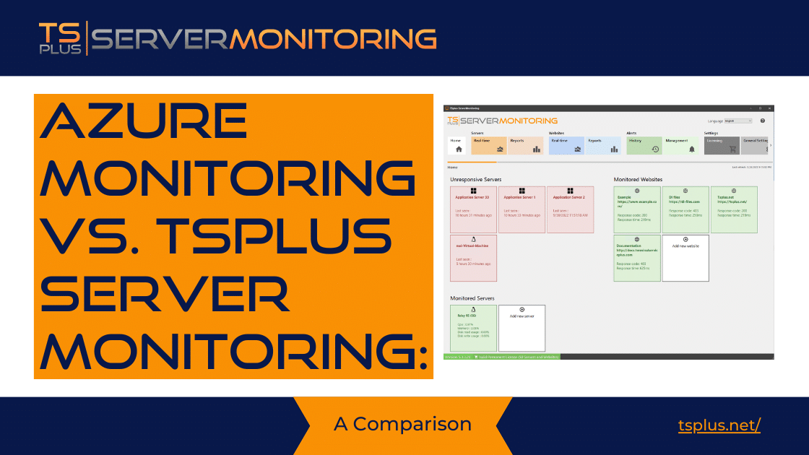

 In the realm of Windows server and infrastructure monitoring, Azure Monitor, Microsoft's comprehensive monitoring solution, is perhaps the most prominent contender. [TSplus Server Monitoring](https://tsplus.net/server-monitoring/), on the other hand, stands as an affordable yet efficient, versatile and highly scalable alternative, specialized in both Windows and Linux server monitoring. Read on to compare features and capabilities of both solutions. Here is a brief but comprehensive comparison allowing IT professionals to make more informed decisions about the choice for their specific needs.

## Azure Monitor: Monitoring with End-to-End Observability

Azure Monitor is a powerful tool that provides end-to-end observability for applications, infrastructure and networks. This Microsoft offering enables organizations to collect, analyze and act on telemetry data from their cloud and hybrid environments. It supports a wide range of operations, helping businesses maximize performance, ensure availability and proactively identify issues.

### Here are some key features of Azure Monitor:

1. **Data Collection and Analysis:** Azure Monitor collects and aggregates data from various sources, including applications, virtual machines, databases and more. It stores this data in a common platform for analysis and correlation.
    
2. **Distributed Tracing:** It allows users to trace requests as they travel through a distributed system, identifying bottlenecks and troubleshooting issues effectively.
    
3. **Logs Platform:** Azure Monitor's centralized logs platform is essential for long-term data storage and sophisticated analysis.
    
4. **Security Monitoring:** It powers security and compliance scenarios with Microsoft Sentinel and Microsoft Defender for Cloud.
    
5. **Visualization Tools:** Users can observe ingested data from their distributed environments through powerful visualization tools.
    
6. **Enterprise Readiness:** Azure Monitor meets strict privacy, security and compliance requirements, making it suitable for mission-critical scenarios.
    
7. **Open and Extensible Platform:** It offers operational dash-boarding, support for open-source solutions, and integration with partner tools like Datadog and Elastic.
    
8. **AI for IT Operations:** Azure Monitor incorporates artificial intelligence to improve service quality, reliability and automation of data-driven tasks.
    

Azure Monitor provides a comprehensive solution for businesses to monitor their environments effectively. Nevertheless, for those seeking an alternative with a focus on Windows and Linux server monitoring, TSplus Server Monitoring offers unique advantages.

## TSplus Server Monitoring: An Efficient and Affordable Solution for Server Monitoring

[TSplus Server Monitoring](https://tsplus.net/server-monitoring/features/) is designed to be a cost-effective, efficient, and specialized solution for Windows and Linux server monitoring. It excels in providing a real-time view of server health and performance and generating customized reports, making it an excellent alternative to Azure Monitor.

### Here are some key features of TSplus Server Monitoring:

1. **Focused Server Monitoring:** TSplus Server Monitoring specializes in monitoring Windows and Linux servers, providing in-depth insights into their performance and health.
    
2. **Load-balancing:** Our load-balancing and farm management features belong in our application publication software, TSplus Remote Access. Check out our Pricing page to see how a bundle can provide you Licences and support for our whole suite at highly advantageous rates.
    
3. **Real-time Monitoring:** It offers real-time monitoring and reporting for servers and websites, allowing IT professionals to troubleshoot issues promptly. Configuring thresholds and alerts is intuitive and additionally brings a responsiveness that is paramount in order to keep networks, websites and application or data-servers running at their best.
    
4. **Secure Monitoring:** TSplus Advanced Security is different piece of the TSplus remote software suite at your disposal alongside Server Monitoring.
    
5. **User-Friendly Interface:** TSplus Server Monitoring's user interface is designed for IT professionals. It has therefore been made both easy to navigate and able to extract specified valuable data adapted to each purpose. Save time and gain in efficiency, and hence concentrate on important tasks.
    
6. **Self-hosted:** TSplus Server Monitoring meets some of the highest data security standards for a number of reasons, including the simple fact you self-host our licensed software as well as the data it generates. You can therefore install Server Monitoring and store the logs it will generate on premises or in the cloud accordingly and access and process it as you wish.
    
7. **Cost-Effective:** TSplus Server Monitoring provides excellent value for money. Its hand-picked features are essentials and it monitors websites and user-sessions in parallel to servers. In addition, our software is intuitive, therefore requiring little to no training. A set of advantages makes it a budget-friendly choice for most businesses.
    
8. **Specialized Support:** The solution is tailored to address the specific needs of IT professionals working with servers, ensuring that they can maintain the performance and availability of their resources.
    

## Making the Choice

While Azure Monitor is a comprehensive and versatile monitoring solution, TSplus Server Monitoring stands out as an easy-to-handle and cost-effective option for Windows and Linux server monitoring. When choosing between the two, remember to consider your organization's specific requirements and budget constraints.

While Azure Monitor is a given for many Microsoft environments, TSplus Server Monitoring is the perfect choice for businesses that require dedicated server monitoring without breaking the budget.

## By Way of Conclusion on Azure Monitoring Compared to TSplus Server Monitoring

Both solutions offer valuable features, but it remains crucial to choose the one that aligns with your IT goals. No doubt the right choice will empower your IT professionals to maximize performance, ensure availability and proactively identify problems.

Consider your infrastructure, budget and specific monitoring requirements to make an informed decision that ensures the performance and availability of your resources. Indeed, in any case, the choice between Azure Monitor and TSplus Server Monitoring depends on the unique needs of your organization.

For further information on TSplus Server Monitoring and its capabilities, [visit our Website](https://tsplus.net/server-monitoring/).
