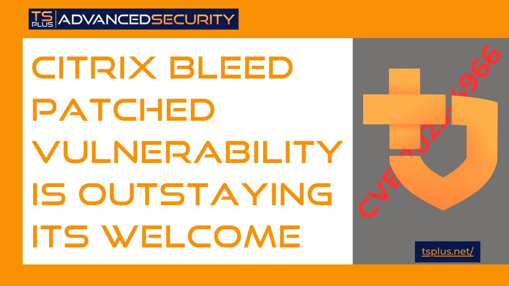
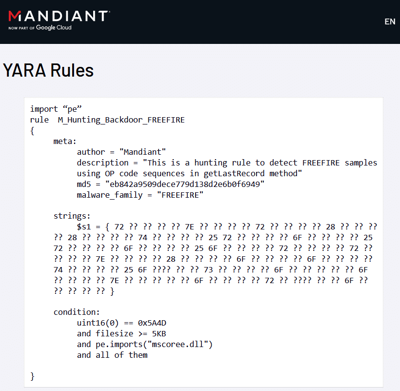

Cyber news is made of stories each more frightening and worrisome than the previous, a fitting theme for the end of October. Citrix Bleed is no exception. After a previous vulnerability and patching in early summer, Citrix has been making headlines most of this autumn with news of inroads into large corporate and governmental networks. Here is how Citrix Bleed vulnerability CVE-2023-4966 is causing sleepless nights in some spheres, ensuing recommendations and our very own solutions and protection to guard your remote infrastructure against such dangers. The news is not all bad.

## Citrix NetScaler ADC and NetScaler Gateway Under Fire

Citrix Bleed, a critical information-disclosure bug affecting NetScaler ADC and NetScaler Gateway, has been under "mass exploitation," with thousands of vulnerable Citrix servers still online in spite of the release of a patch on October 10. Since then, regular waves of news have reminded us that the vulnerability is still allowing attackers to access the memory of exposed devices. There, attacks extract session tokens for unauthorized access, even once the patch has been applied.

Ransomware gangs have been exploiting this vulnerability and Mandiant is tracking multiple groups targeting various sectors globally. The US government has classified it as an unknown exploited vulnerability. Google-owned Mandiant emphasizes the need to terminate all active sessions for effective mitigation. The bug has been exploited since late August, with criminals using it for cyber espionage. Financial threat actors have been expected to exploit, so it is all the more important to stop Citrix Bleed before it is too late.

## CVE-2023-4966 Vulnerability Ongoing in Spite of Patching

It appears that, as of October 30, had left over 5,000 vulnerable servers exposed on the public internet. GreyNoise observed 137 individual IP addresses attempting to exploit this Citrix vulnerability within the past week. Despite Citrix's prompt disclosure and issuance of a patch (CVE-2023-4966) on October 10, the situation escalated rapidly. Even after applying the patch, session tokens persisted, leaving systems vulnerable to exploitation. The gravity of the situation is underscored by the fact that, as feared, ransomware crews have jumped on the opportunity to exploit this vulnerability, distributing python scripts to automate the attack chain.

## Strategically Thought-out Tools and Steps for the Attacks

These attacks have donned a multifaceted nature as they progressed beyond the initial exploitation. The attackers seemed initially engaged in network reconnaissance. Yet, goals have obviously extended to the theft of critical account credentials and shown lateral movement through the compromised networks. In this phase, they employed a diverse set of tools, demonstrating a well-orchestrated approach to their malicious activities.

Those behind these campaigns have demonstrated a high level of sophistication in their approach, employing a wide array of tools and techniques to achieve their goals. Attackers used specially crafted HTTP GET requests to force the Citrix appliance to reveal system memory contents, including valid Netscaler AAA session cookies. This has been allowing them to bypass multifactor authentication, making their intrusion even more insidious.

## Look Out for the Specific Tool Combination

One notable tool in their arsenal is FREEFIRE, a novel lightweight .NET backdoor using Slack for command and control. This is the sole unusual tool in the arsenal. Attacks leveraged many standard and native processes, with the addition the run of the mill remote desktop access and management tools Atera, AnyDesk and SplashTop. This goes to show how hard hackers have worked to remain invisible to detection. Indeed, whereas individually, these tools are generally found in legitimate enterprise environments, only their combined deployment by the threat actors serves as a significant red flag. Unless your security software and team are looking out for this combination indicative of a compromise, it would pass unnoticed.

Here is the list of tools the hackers have been using to retrieve session information and move horizontally through networks (as well as their purposes as described by Bleeping Computer):

- **net.exe**  Active Directory (AD) reconnaissance;
    
- **netscan.exe**  internal network enumeration;
    
- **7-zip**  create an encrypted segmented archive for compressing reconnaissance data;
    
- **certutil**  encode (base64) and decode data files and deploy backdoors;
    
- **e.exe and d.dll**  load into the LSASS process memory and create memory dump files;
    
- **sh3.exe**  run the Mimikatz LSADUMP command for credential extraction;
    
- **FREEFIRE**  novel lightweight .NET backdoor using Slack for command and control;
    
- **Atera**  Remote monitoring and management;
    
- **AnyDesk**  Remote desktop;
    
- **SplashTop**  Remote desktop.
    

As you probably agree, nothing much untoward unless you find them all being combined. Except for one, that is: FREEFIRE.

## FREEFIRE in Particular Used by Hackers in Citrix Bleed

It is worth noting that while some of these tools are commonly found in enterprise environments, their combined usage in these campaigns is a strong indicator of a breach. Mandiant has even released a Yara rule employed to detect the presence of FREEFIRE on a device. This tool is particularly valuable in helping organizations proactively identify compromised systems and take swift action to mitigate the risk.

Below, you can find the Yara rule for detecting FREEFIRE. Still, should you wish to verify the Yara rule there or to read the MITRE ATT&CK techniques, these close the Mandiant article. There, you can also find their link to Mandiants Citrix NetScaler ADC/Gateway: CVE-2023-4966 Remediation guide in PDF.

## Mandiant's Yara Rules to Hunt Down FREEFIRE in Citrix Bleed Context

And the rule as text:

Yara Rule: import pe
rule M\_Hunting\_Backdoor\_FREEFIRE
{
meta:
author = "Mandiant"
description = "This is a hunting rule to detect FREEFIRE samples
using OP code sequences in getLastRecord method"
md5 = "eb842a9509dece779d138d2e6b0f6949"
malware\_family = "FREEFIRE"
strings:
$s1 = { 72 ?? ?? ?? ?? 7E ?? ?? ?? ?? 72 ?? ?? ?? ?? 28 ?? ?? ??
?? 28 ?? ?? ?? ?? 74 ?? ?? ?? ?? 25 72 ?? ?? ?? ?? 6F ?? ?? ?? ?? 25
72 ?? ?? ?? ?? 6F ?? ?? ?? ?? 25 6F ?? ?? ?? ?? 72 ?? ?? ?? ?? 72 ??
?? ?? ?? 7E ?? ?? ?? ?? 28 ?? ?? ?? ?? 6F ?? ?? ?? ?? 6F ?? ?? ?? ??
74 ?? ?? ?? ?? 25 6F ???? ?? ?? 73 ?? ?? ?? ?? 6F ?? ?? ?? ?? ?? 6F
?? ?? ?? ?? 7E ?? ?? ?? ?? ?? 6F ?? ?? ?? ?? 72 ?? ???? ?? ?? 6F ??
?? ?? ?? ?? }
condition:
uint16(0) == 0x5A4D
and filesize >= 5KB
and pe.imports("mscoree.dll")
and all of them
}

## Some Reminders for Fending Off Citrix NetScaler Vulnerability CVE-2023-4966

The convergence of these findings highlights the pressing need for organizations to adopt a comprehensive incident response approach. Simply applying the available security updates is insufficient in addressing existing breaches. The fact it is essential to close all active sessions lest they remain exploitable can simply not be sufficiently underlined. A fully fledged response is imperative to contain the breach, assess the extent of the compromise, and where necessary initiate the steps required for system restoration.

Mandiant's remediation guide and other publications offer essential practical steps for organizations navigating these challenging post-exploitation scenarios. Governmental organisations globally are relaying these recommendations, warnings and safeguard processes in a bid to put a halt to these attacks.

## TSplus Advanced Security - The Best Protection Against Citrix Bleed and other Attacks

We are convinced our 360 cyber protection, [TSplus Advanced Security](https://tsplus.net/advanced-security/features/), is unequalled to protect your business and IT infrastructure against this threat and others. Indeed, vulnerabilities such as the Citrix Bleed exploit point to the inadequacy of cybersecurity in too many contexts and infrastructures. Therefore, businesses must prioritize comprehensive solutions to safeguard their IT infrastructure and sensitive data. TSplus Advanced Security stands as a robust and all-encompassing answer to these pressing concerns.

This comprehensive security tool offers a multifaceted approach to ensure the protection of IT systems, guarding against a wide array of threats, including zero-day exploits, malware and unauthorized access.

https://tsplus.net/wp-content/uploads/2023/11/Citrix-Bleed-Patched-Vulnerability-is-Outstaying-its-Welcome.mp4

## TSplus Advanced Security as Part of a Wholistic Remote Software Suite

One of the key benefits of TSplus Advanced Security lies in its ability to fortify your organization's IT infrastructure against vulnerabilities like CVE-2023-4966, which have a far-reaching impact. It enables businesses to secure their systems by preventing unauthorized access and effectively mitigating cybersecurity threats.

Furthermore, the broader TSplus software suite offers invaluable features that complement TSplus Advanced Security. Similarly to the four cardinal points, we have four pillars to a remote network: security, access, monitoring and support.

## TSplus Remote Access for Session Logoff and Granular Management

Firstly, [TSplus Remote Access](https://tsplus.net/remote-access/), thus, includes session logoff parameters that enhance security by ensuring that user sessions are correctly terminated. Paramount, this reduces the risk of unauthorized access. This feature is vital in addressing correlated issues such as those brought about by the exploits of the Citrix Bleed incident. By ensuring that no session tokens persist, even after patching, it provides an additional layer of protection.

## TSplus Server Monitoring for Server and User-session Surveillance

In additional, [TSplus Server Monitoring](https://tsplus.net/server-monitoring/) is an indispensable tool for organizations. Indeed, it enables you to monitor the health of their servers and websites in real-time. In the context of Citrix Bleed or similar vulnerabilities, Server Monitoring allows swift identification of issues, in turn making it easier to initiate timely troubleshooting and remediation. This proactive approach is essential for maintaining the integrity of IT systems and preventing breaches.

## TSplus Remote Support for Distant Control, Fixing and Training

Lastly, [TSplus Remote Support](https://tsplus.net/remote-support/) plays a pivotal role in addressing cybersecurity challenges. It facilitates remote assistance and unattended intervention for any IT issue, ensuring swift resolution and minimizing the risks associated with ongoing vulnerabilities. Whether troubleshooting a Citrix vulnerability or addressing any other IT concern, TSplus Remote Support empowers organizations to respond quickly, effectively and securely, from anywhere.

## As a Conclusion to Citrix Bleed Vulnerability CVE-2023-4966 Outstaying its Welcome In Spite of Patching

**In summary, TSplus Advanced Security is a great tool against such vulnerabilities.** And, in combination with the rest of the software suite, it forms a robust line of defense against cybersecurity threats of all kinds as well as offering granular management, real-time monitoring and rapid response capabilities. **What more could you ask for to secure your IT infrastructures and safeguard sensitive company data.**

**Whether you want to safeguard your companys IT infrastructure against cyber-attacks or want to replace Citrix as a whole, [get in touch today by phone, email or via our website](https://tsplus.net/pricing/) and get your quote or trial in seconds or a few clicks.**
