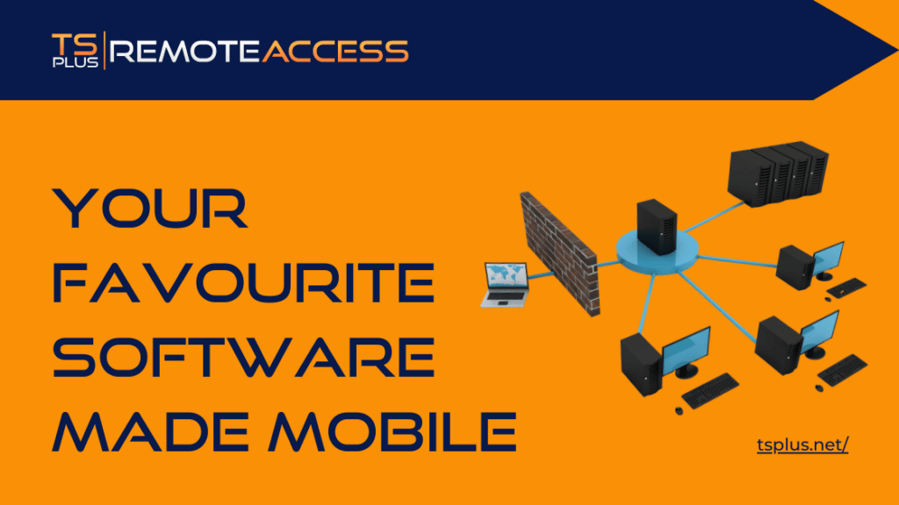

**The Myth of Web Based Applications Services:**

Some staffing companies consider web-based systems and services. It is important to weigh up Why web based?. Most often, this will bring up more questions and some pre-conceived ideas. Typically: Isnt that what everybodys doing? or I dont want to make a large investment., Web-based services arecheaper. or even I dont want to be responsible for my own network.

## Misunderstanding of Web-based Services

This underlines a general misunderstanding of web services platforms as well as what its relative strengths and weaknesses happen to be. When choosing a staffing software system or any other major item of software for your business, it is important to understand how the system is going to be used. The aim is to select a platform that will deliver the best and most cost-efficient results. Be it hosted in the cloud or not, on your premises or elsewhere.

## Discussion around Web Hosted Services

Following is a quick discussion of some of the main benefits touted by web-based systems. Next, well see some of the compromises one will have to bear in order to use them. Then, we can wrap up with a review of the principal alternative and our very own solution: [TSplus Remote Access](https://tsplus.net/remote-access/).

## Web based systems can be run from anywhere that has access to the internet.

This is true, but it is not the exclusive domain of web-based systems. Pretty much any system can be run using the internet as a connection conduit. Microsoft has included a capability in their Windows operating system called Terminal Services that enables users to access applications on the Windows network via the internet.

Conclusion: No clear-cut advantage.

## I wont have to maintain my own network.

This is only true if every user has their own individual internet connection. In most offices, many users connect to the same telecomline. In order for everyone to access the shared resource, a network must exist. Most likely, staff will need file sharing, e-mail and print services locally. Therefore, some network administration will be required.

Additionally, firewalls, virus protection and some kind of local expertise are crucial. Finally, most importantly, a back-up routine is still required.

Conclusion: No advantage.

You still have to do all the network admin stuff anyway. In addition, theres someone between you and one of your most valuable assets: your data. Should a dispute ever arise, someone would be in a position to cut your company off from its lifes blood.

## The user interface is easier to learn since its like a web page.

With any system the designer has to create the methods and workflows. They will be forced to use conventions, abbreviations, icons and other devices as they attempt to get the most functionality per inch of available screen space. The user will still have to learn how the system works and get used to its specific paths. All the more, while it is true that many people are familiar with how to navigate web pages, the same can be said of Windows applications. In fact, Windows programs generally adhere more rigorously to a set of standards than web-based programs tend to.

Conclusion: No advantage. There will still be a learning curve and training requirements to effectively use such software.

## What theyre not telling you:

1\. Web based systems run through a web browser. This means that the user interface is constrained by the limits of the browser itself. The browser will limit the number of records that can be open at a time, will force more data integrity responsibility on the user and often users canexperience long delays.

2\. Web based systems, or just about any system delivered through an ASP are significantly more expensive. This is a classic rent vs. buy decision. If your company has 10 system users and you have to pay $199 per month per user, thats a $1,990 per month outlay. This is the equivalent of purchasing a $60,000 system (based on a 36 months, $1 buyout lease). There arent many systems that charge $6,000 per user. This is exorbitantly expensive.

## The best alternative to Web Based Services:

This is easy. Windows based (client/server) systems answer all the questions raised above. These systems can be delivered to diverse and remote users via the web. They also run on the same basic network (with the addition of SQL Server) that satisfies the rest of our needs. Additionally, they have exceedingly rich user interfaces  generally offering many more features. Finally, they are easy to learn and usually out-perform systems running from the web.All in all, they also provide much more bang for the buck.

Having your database in your office isnt necessarily bad, as it remains under your control. Whats more, these systems are generally more mature. Thus, they offer a far greater range of features as well as being typically more stable. All this translates into a better, more cost-effective computing experience for your company. After all, youre not in this to support the technology; you expect the technology to support you.

## TSplus Remote Access the Affordable Way to Publish your Apps to the Web

**TSplus software make use of Microsofts inherent Terminal Services or RDP. With [Remote Access](https://tsplus.net/remote-access/features/), you can publish any of the software you already have to the Web.** **It remains hosted wherever you choose but is displayed seamlessly wherever you and your teams need. Users can connect in a variety of manners and there are a number of available features for security, network, client base, staff log-in and more.** **Download from our [website](https://tsplus.net/) now, to buy or test our software products.**
