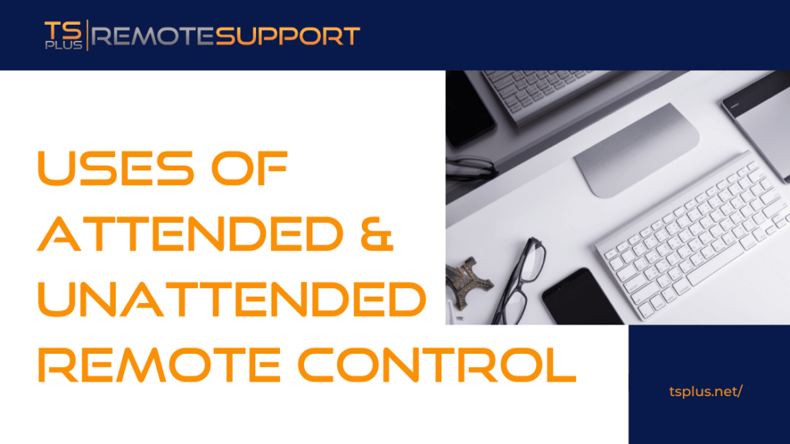

 IT agents all over the world have been providing support, updates, and other fixes remotely for many years. This has accelerated with the recent pandemic but the trend was already well established before any lock-downs confined whole societies to work from home and cut contact with anyone. Indeed, IT provides something invisible and constant to countless organisations, businesses and more, planet-wide. In all honesty, all probably needed 24-7 365 attention from the word go. [TSplus](https://tsplus.net/) saw this need a while ago so offers unattended access as a feature of its Remote Support software.

## A Need for Remote Control and Support Attended and Unattended Remote Control

Hospitals, universities, governments, businesses and corporations of all kinds, members of the general public... The list of potential people and their devices that could need support is endless.

Regardless of where and why, it is clear that remote control and support of devices is quintessential to the way whole parts of our modern society functions nowadays. Technicians are able to maximise their time and efficiency thanks to remote support possibilities. They can access any device anywhere thanks to remote connectivity and to the functionalities of the software that makes their work possible.

## A Need for Attended and Unattended Remote Control

In addition to that, it is worth noting that IT glitches don't wait for the workday to happen and that some updates, upgrades, fixes and similar tasks take a very long time. Both of these factors alone make a case for unattended support to be available in parallel to attended support.

## Using Attended and Unattended Remote Control

Attended support and control is great when the agent and the client need to be in conversation about the work the agent needs to carry out. Such occasions will include an IT problem, an issue with the client's device which they need to describe to the agent. It may be they need to perform particular tasks and have given the agent the remit to put things in place and prepare their device to do this.

Additionally, it can be very interesting to use attended remote control during training sessions, specially as TSplus Remote Support lets several agents view the same screen. Interaction thus becomes possible in a new ways for demonstration purposes. For instance, it is useful to show other members of a team particular actions which they will need to repeat or the possibilities of a new piece software.

Unattended remote support, on the other hand, can involve silent upgrades while staff are away from their device. Agents may fix issues with servers or other devices either overnight or out of hours, or simply at a set time when the users are otherwise engaged.

## Specifics of Setting up Attended Access with TSplus

TSplus Remote Support has been developed to be as user-friendly as possible while remaining affordable, secure and featuring the actions support agents generally expect of such software. Setup is straight-forward, requiring a rapid download and run of the console for either agent or end-user. Then the end-user needs to share their ID and password so the agent can enter them and establish the connection.

All this takes mere moments and can be done directly if needed, or the agent can log in for a more personalised experience. Indeed, TSplus Remote Support software can bear your company name and logo, colours and branding, and each agent can add their title and photo as well as simplify the console appearance at the client end. All this makes for reassuring and simple interactions between parties and for a more serene overall use.

## Specifics of Setting up Unattended Access with TSplus Remote Support

Amongst the tools available to agents are their list of remote devices. They can add remote devices to their unattended machines and so long as the end-user leaves the connection open and available, interventions are possible anytime. It is worth noting that, to end a connection, all the client needs to do is close their Remote Support window.

Of course, the end-device needs to remain on for the unattended connection to stay live. Remote control is then possible while the end-user is away from their machine, either for meetings, break or not at work.

Other than adding or removing devices from their list, agents can send command prompts, an essential in some instances. Being able to work on an unattended device has the advantages of not needing to lock mouse or keyboard input from the remote device and of not breaking end-user workflow. Moreover, it makes it possible for agents to spread workloads and schedule their work conveniently, thus avoiding bottle-necks and overworking being followed by times of waiting for the next mission.

## Team Possibilities with Attended and Unattended Remote Support and Control

Above, I mentioned how teams could make good use of controlling screens, mouse and keyboard remotely for demonstration and training purposes. Equally, one agent may call colleagues in on a particular intervention for joint assistance. They may show a new recruit what can be done and how to proceed. Another occasion may include discovering new software or a recent fix.

With a few select features, the potential is as broad as agents and clients will make it. Whichever way, the ergonomics and ease-of-use of TSplus software makes the experience all the simpler.

## TSplus Solution for Remote Support and Control

**[TSplus Remote Support](https://tsplus.net/remote-support/) is a simple secure and affordable remote control solution with all the scalability and versatility to get the job done from small freelance businesses to corporations.**

**Come and try our software for 15 days for free or read more before you buy.**
