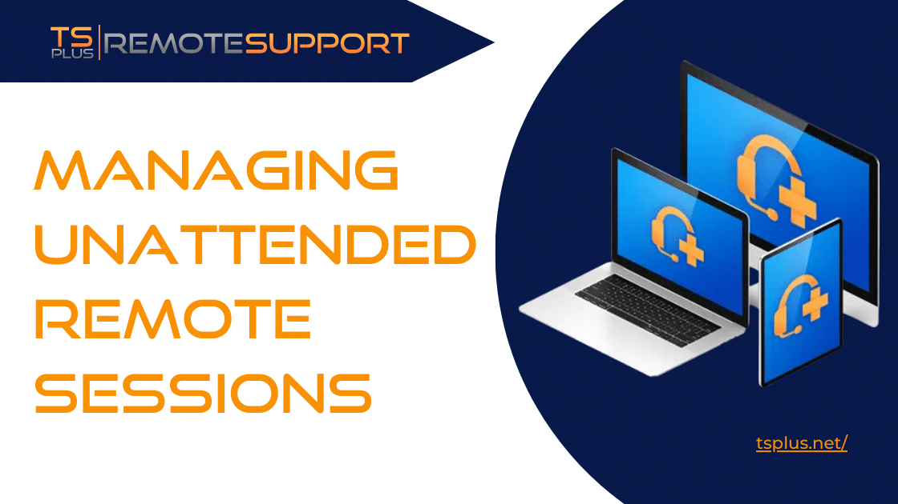

 When it comes to remote support software, unattended computers is a feature that can prove more than handy. What is an unattended remote support session? How is the functionality used? How are they generated or terminated? And especially, how do you go about managing unattended remote sessions? Read on to find out more.

## What are Unattended Remote Support Sessions?

Unattended remote sessions are the same as remote sessions, with one very useful difference: the end-user (host) does not need to be present at the time of intervention. Indeed, the connection can take place thanks to prior arrangement made by the host with the support agent. If this is all you needed to refine your knowledge, then feel free to go directly to our user guide section to [start using TSplus Remote Support unattended sessions](https://docs.terminalserviceplus.com/remote-support-v3/unattended).

A remote session enables the agent to control the host device for a range of purposes. The agent sees the hosts screen as though it were his own. An agent can input mouse and keyboard from their device to control the hosts. Additionally, another possibility is to send command lines. Yet other actions are usually available depending on the chosen remote support tool.

## Examples of Situations Adapted to Unattended Remote Support

- Here are some cases when unattended sessions are the ideal solution.
    
- Out of office-hours intervention needs, due for instance to the fact host and agent work different shifts or are in different time-zones.
    
- Troubleshooting, fixes or updates that need to be done while the computer is not otherwise in use.
    
- Enabling invisible intervention times which do not impede on the hosts productivity.
    

## How do You Manage Unattended Remote Sessions?

### From a Host's Standpoint - Configuring Unattended Remote Support

End-users are the ones who enable this feature. Consequently, only the host can choose to make their PC available remotely at any time without their presence being required. Follow these steps to enable unattended sessions:

1. Choose an Unattended Password. This password is reserved for this particular purpose and does not affect your main credentials for Remote Access.
    
2. This done, you need to click the now active button: Enable Unattended Access.
    
3. The final configuration step as a host is to share your Remote Support ID plus your unattended access password with your support agent.
    

### From the Agents Standpoint  Managing Unattended Remote Sessions

- Agents need a hosts ID and password to activate a remote session, whether attended or unattended. As an agent, using the unattended-specific password will enable you to open an unattended session rather than the temporary attended sort.
    
- Within the agents' admin console, you can each save a list of the computers which you can access remotely. Here, computers are easily added or removed. Also, listed computers are searchable and their information can be amended.
    
- There is an option to save a password for those computers with enabled unattended sessions.
    
- You will notice a green dot or a red one next to each listed device. The green or red dots respectively indicates an available or unavailable PC. For each available PC, Connect is your one-click session-launching button.
    
- Nonetheless, rather than connecting, you can choose to send a command prompt. [Full actions and features are detailed in the user-guide](https://docs.terminalserviceplus.com/remote-support-v3/computers).
    

### How Do You End an Unattended Remote Session?

Note that end-users are free to change their password at any time. Additionally, they can disable unattended access whenever they chose. Either of these actions will terminate the related live unattended sessions. Otherwise, simply closing the chat box of a temporary remote session will end the connection. Then, in either case, you will need to open a new session to resume remotely sharing computers.

## To Conclude on Managing Unattended Remote Computers

**Unattended access offers a freedom of actions and a flexibility that can ease the strain on any IT team as well as on company wide staff. TSplus Remote Support is so simple to use, it takes moments to get maintenance or training underway. Its unattended computers feature is no exception: rapidly setup, quickly in hand. [For more about Remote Support, its security and other features](https://tsplus.net/remote-support/) and to start using unattended remote sessions right away, please visit our website.**
